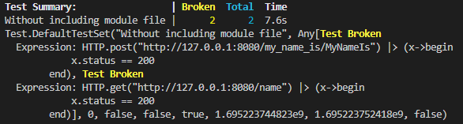
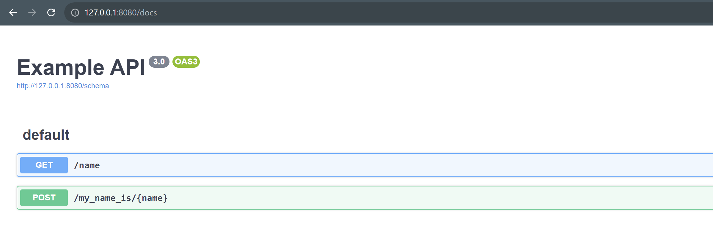

# Issue Description

We will use the OxygenExample primitive package as an example. Within the main module, queries using the appropriate Oxygen macros (@post, @get) are defined, as well as documentation for these queries using the @swagger macro from SwaggerMarkdown. Also a function to run server is defined here.

Then, if we just use OxygenExample without including file with its definition and run server, no documentation we can see and no requests can make:

```
using OxygenExample
OxygenExample.start_server()
```

### http://127.0.0.1:8080/docs result:


### Tests result:
@testset "Without including module file" begin
    @test HTTP.post("http://127.0.0.1:8080/my_name_is/MyNameIs") |> x -> x.status == 200
    @test HTTP.get("http://127.0.0.1:8080/name") |> x -> x.status == 200
end



But if we include file with main module definition, everything starts to work (even without using .OxygenExample and restart server):

```
include("../src/OxygenExample.jl")
```

### http://127.0.0.1:8080/docs result:


### Tests result:
@testset "Without including module file" begin
    @test HTTP.post("http://127.0.0.1:8080/my_name_is/MyNameIs") |> x -> x.status == 200
    @test HTTP.get("http://127.0.0.1:8080/name") |> x -> x.status == 200
end


So, I have some ideas how to solve this problem, but would like to know the right way.